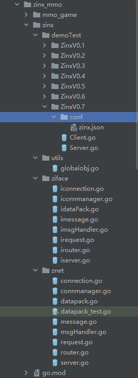
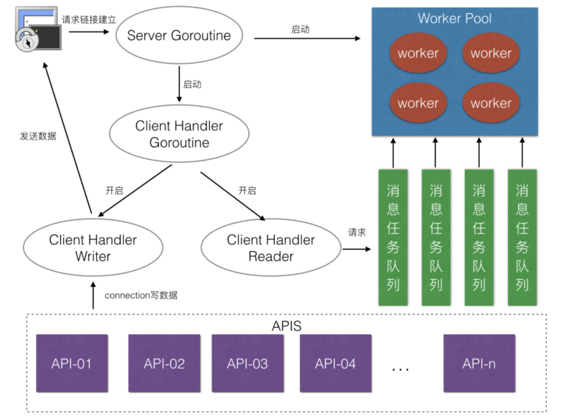
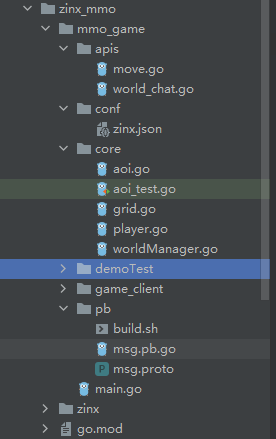

## 引言

在该项目中有两个部分，一个是zinx，一个是mmo_game，zinx是一个tpc框架，而mmo_game是一个基于此框架设计的一个小游戏。

该项目的教学视频：[https://www.bilibili.com/video/BV1wE411d7th?spm_id_from=333.337.search-card.all.click](https://www.bilibili.com/video/BV1wE411d7th?spm_id_from=333.337.search-card.all.click)

## zinx

### 项目结构

<center></center>

#### server

server对外提供一个NewServer()方法，用于创建服务器，服务器的一些配置信息在zinx.json中配置，并由globalobj读取， 服务器创建的时候调用globalobj中的属性。

调用server()方法启动服务器，①首先会启动线程池 ②解析一个tcp的addr ③根据addr获取监听器 ④监听链接请求，当有客户端链接时，获取链接，判断链接是否超过最大个数，没超过则创建自定义链接，并启动链接，否则就关闭链接

server中管理着链接管理器，消息处理模块以及两个钩子函数。我们可以通过AddRouter()方法设置指定信息格式的处理方法，还可以设置链接建立后和销毁前的钩子函数。

```go
//iServer的接口实现，定义一个Server的服务器模块
type Server struct {
    //服务器名称
    Name string

    //服务器绑定的ip地址
    IPVersion string

    //服务器坚挺的ip
    IP string

    //服务器监听的端口
    Port int

    //当前server的消息管理模块，用来绑定MsgID和对应的处理业务的API关系
    MsgHandler ziface.IMsgHandle

    //该server的链接管理器
    connManager ziface.IConnManager

    //该Server创建链接之后自动调用Hook函数-OnConnStart
    OnConnStart func(conn ziface.IConnection)

    //该Server销毁链接之前自动调用Hook函数-OnConnStop
    OnConnStop func(conn ziface.IConnection)
}
```

```go
/**
初始化Server模块的方法
*/
func NewServer(name string) ziface.IServer {
	s := &Server{
		Name:        utils.GlobalObject.Name,
		IPVersion:   "tcp4",
		IP:          utils.GlobalObject.Host,
		Port:        utils.GlobalObject.TcpPort,
		MsgHandler:  NewMsgHandle(),
		connManager: NewConnManager(),
	}
	s.Name = name

	return s
}

//启动服务器
func (s *Server) Start() {
    fmt.Printf("[Start] Server Listenner at IP: %s,Port %d, is starting\n", s.IP, s.Port)

    go func() {
        //开启线程池
        s.MsgHandler.StartWorkerPool()

        //1.解析一个tcp的addr
        addr, err := net.ResolveTCPAddr(s.IPVersion, fmt.Sprintf("%s:%d", s.IP, s.Port))
        if err != nil {
            fmt.Println("resolve tcp addr error：", err)
            return
        }
        //2.获取监听器
        listener, err := net.ListenTCP(s.IPVersion, addr)
        if err != nil {
            fmt.Println("listen ", s.IPVersion, " err ", err)
            return
        }

        fmt.Println("start Zinx server succ", s.Name, " succ ,Listenning: ")
        var cid uint32
        cid = 0

        //3.阻塞的等待客户端链接，处理客户端链接业务
        for {
            //如果有客户端链接过来，阻塞会返回
            conn, err := listener.AcceptTCP()
            if err != nil {
                fmt.Println("Accept err", err)
                continue
            }

            //设置最大连接数的判断
            if s.connManager.LenConn() >= utils.GlobalObject.MaxConn {
                //TODO 给客户端响应一个超出最大链接的错误包
                conn.Close()
                continue
            }

            //将处理新连接的业务方法 和 conn进行绑定 得到我们的链接模块
            dealConn := NewConnection(s, conn, cid, s.MsgHandler)
            cid++

            //启动当前的链接业务处理
            go dealConn.Start()
        }
    }()
}

//停止服务器
func (s *Server) Stop() {
    //将一些服务器的资源、状态或者一些已经开辟的链接信息进行停止或回收
    fmt.Println("[STOP] Zinx server name ", s.Name)
    s.connManager.ClearConn()

}

//运行服务器
func (s *Server) Serve() {
    //启动server
    s.Start()

    //做一些服务器启动后的额外业务

    //阻塞状态
    select {}
}
```

#### connection

当创建一个链接并启动后，会创建读和写协程，并调用链接创建的钩子函数。

读协程监听客户端发来的数据，获取数据对数据进行解封成一个message，因为使用的是TLV封包方法，因此先获取标志和长度，再通过长度长度获取数据封装进message中。然后将message封装到一个request中，交给线程池处理。

写协程会监听一个data channel和一个exit channel，当data channel有数据时，会写给客户端，当exit channel有数据时，则退出。

对外提供了一个SendMsg方法，当要发送数据给客户端时，调用该方法，对传入的msgid和数据组成一个message并进行封包，传入data channel中供写协程获取传输。

在构建我们的钩子函数时，可以设置一些property和该conn进行绑定。

```go
package znet

import (
    "errors"
    "fmt"
    "io"
    "net"
    "sync"
    "zinxMmo/zinx/utils"
    "zinxMmo/zinx/ziface"
)

type Connection struct {
    //当前链接所属的server
    server ziface.IServer

    //当前链接两点socket tcp套接字
    Conn *net.TCPConn

    //链接的ID
    ConnID uint32

    //当前的链接状态
    isClosed bool

    //告知当前链接已经退出的/停止 channel
    ExitChan chan bool

    //无缓冲的管道，用于读、写Goroutine之间的消息通信
    msgChan chan []byte

    //该链接处理的方法Router
    MsgHandler ziface.IMsgHandle

    //链接属性集合
    property map[string]interface{}

    //保护链接属性的锁
    propertyLock sync.RWMutex
}

//初始化链接模块的方法
func NewConnection(server ziface.IServer, conn *net.TCPConn, connID uint32, msgHandler ziface.IMsgHandle) *Connection {
    c := &Connection{
        server:     server,
        Conn:       conn,
        ConnID:     connID,
        isClosed:   false,
        ExitChan:   make(chan bool, 1),
        msgChan:    make(chan []byte),
        MsgHandler: msgHandler,
        property:   make(map[string]interface{}),
    }

    //将当前链接保存到链接管理器中
    server.GetConnManager().AddConn(c)

    return c
}

//链接的读业务方法
func (c *Connection) StartReader() {
    fmt.Println("[Reader Goroutine is running...]")
    defer fmt.Println("connID=", c.ConnID, "Reader is exit,remote addr is", c.GetRemoteAddr().String())
    defer c.Stop()

    for {
        //读取客户端的数据到buf中，最大512B
        //buf := make([]byte, utils.GlobalObject.MaxPackageSize)
        //_, err := c.Conn.Read(buf)
        //if err != nil {
        //	fmt.Println("recv buf err", err)
        //	continue
        //}

        //创建一个拆包解包对象
        dp := NewDataPack()

        //读取客户端的Msg Head 8B
        headData := make([]byte, dp.GetHeadLen())

        if _, err := io.ReadFull(c.GetTcpConnection(), headData); err != nil {
            fmt.Println("read msg head error", err)
            break
        }

        //拆包，得到msgID 和 msgDatalen 放在msg消息中
        msg, err := dp.Unpack(headData)
        if err != nil {
            fmt.Println("unpack error", err)
            break
        }

        //根据datalen再次读取Data，放在msg.Data中
        data := make([]byte, msg.GetDataLen())
        if msg.GetDataLen() > 0 {
            if _, err := io.ReadFull(c.GetTcpConnection(), data); err != nil {
                fmt.Println("read msg data error", err)
                break
            }
        }
        msg.SetData(data)

        //得到当前conn数据的Request请求数据
        req := &Request{
            conn: c,
            msg:  msg,
        }

        //判断是否开启工作池
        if utils.GlobalObject.WorkerPoolSize > 0 {
            //交给线程池
            c.MsgHandler.SendMsgToTaskQueue(req)
        } else {
            //执行注册的路由方法
            c.MsgHandler.DoMsgHandler(req)
        }

        //从路由中，找到注册绑定的Conn对应的router调用

    }

}

//写消息，专门发送给客户端消息的模块
func (c *Connection) StartWriter() {
    fmt.Println("[Write  Goroutine is running...]")
    defer fmt.Println("connID=", c.ConnID, "Writer is exit,remote addr is", c.GetRemoteAddr().String())

    //不断地阻塞等待channel的消息，进行写给客户端
    for {
        select {
            case data := <-c.msgChan:
            //有数据要写给客户端
            if _, err := c.Conn.Write(data); err != nil {
                fmt.Println("Send data error,", err)
                return
            }
            case <-c.ExitChan:
            //代表Reader已经退出，此时Writer也要推出
            return
        }

    }

}

//启动链接 让当前的链接准备开始工作
func (c *Connection) Start() {
    fmt.Println("Conn Start()... ConnID = ", c.ConnID)

    //启动从当前链接的读数据的业务
    go c.StartReader()
    //启动从当前链接写数据的业务
    go c.StartWriter()

    //此时已经创建链接成功，调用用户创建的Hook函数
    c.server.CallOnConnStart(c)

}

//停止链接 结束当前链接的工作
func (c *Connection) Stop() {
    fmt.Println("Conn Stop().. ConnID = ", c.ConnID)

    //当前链接已经关闭
    if c.isClosed == true {
        return
    }
    c.isClosed = true

    //移除链接
    c.server.GetConnManager().RemoveConn(c)

    //此时链接将要关闭，调用用户创建的Hook函数
    c.server.CallOnConnStop(c)

    //关闭socket链接
    c.Conn.Close()

    //告知writer关闭
    c.ExitChan <- true

    //回收资源
    close(c.ExitChan)
    close(c.msgChan)
}

//获取当前链接的绑定socket conn
func (c *Connection) GetTcpConnection() *net.TCPConn {
    return c.Conn
}

//获取当前链接模块的链接ID
func (c *Connection) GetConnID() uint32 {
    return c.ConnID
}

//获取远程客户端的TCP状态 IP port
func (c *Connection) GetRemoteAddr() net.Addr {
    return c.Conn.RemoteAddr()
}

//提供一个sendMSG方法，将我们要发送给客户端的数据，先进行封包，再发送
func (c *Connection) SendMsg(msgId uint32, data []byte) error {
    if c.isClosed {
        return errors.New("Connection closed when send msg")
    }

    dp := NewDataPack()

    binaryMsg, err := dp.Pack(NewMsgPackage(msgId, data))

    if err != nil {
        fmt.Println("Pack error msg id = ", msgId)
        return errors.New("Pack error msg")
    }

    //将数据发送给客户端
    c.msgChan <- binaryMsg

    return nil
}

//设置链接属性
func (c *Connection) SetProperty(key string, value interface{}) {
    c.propertyLock.Lock()
    defer c.propertyLock.Unlock()

    //添加一个属性
    c.property[key] = value
}

//获取链接属性
func (c *Connection) GetProperty(key string) (interface{}, error) {
    c.propertyLock.RLock()
    defer c.propertyLock.RUnlock()

    //获取属性
    if value, ok := c.property[key]; ok {
        return value, nil
    }
    return nil, errors.New(" no property found!")
}

//移除链接属性
func (c *Connection) RemoveProperty(key string) {
    c.propertyLock.Lock()
    defer c.propertyLock.Unlock()

    //删除属性
    delete(c.property, key)
}
```

#### msgHandler

主要用于对不同的消息进行处理。内部保存了一个Apis map集合，保存了不同消息的处理方法。

在启动服务器时会创建一个线程池，即创建一个消息队列和多个协程，协程监听消息队列，当某一个协程监听到request时，会根据request中message对应msgId获取不同的router，然后依次调用router中的preHandle、handle、postHandle进行处理。

```go
/**
消息处理模块的实现
*/
type MsgHandle struct {
    //存放每个MsgID所对应的处理方法
    Apis map[uint32]ziface.IRouter

    //负责Worker取任务的消息队列
    TaskQueue chan ziface.IRequest

    //业务工作Worker池的worker数量
    WorkerPoolSize uint32
}

//初始化/创建MsgHandle方法
func NewMsgHandle() *MsgHandle {
    return &MsgHandle{
        Apis:           make(map[uint32]ziface.IRouter),
        TaskQueue:      nil,
        WorkerPoolSize: utils.GlobalObject.WorkerPoolSize,
    }
}

//为消息添加具体的处理逻辑
func (mh *MsgHandle) AddRouter(msgID uint32, router ziface.IRouter) {
    if _, flag := mh.Apis[msgID]; flag {
        //已经存在
        panic("repeat api,msgID = " + strconv.Itoa(int(msgID)))
    }
    //添加
    mh.Apis[msgID] = router
    fmt.Println("Add api MsgID = ", msgID, "succ!")
}

/**
单个进行处理
*/

//调度/执行对应的Router消息处理方法
func (mh *MsgHandle) DoMsgHandler(request ziface.IRequest) {
    //从request中找到msgID
    router, flag := mh.Apis[request.GetMsg().GetId()]
    if !flag {
        fmt.Println("api MsgID = ", request.GetMsg().GetId(), " is NOT FOUND!Need Register!")
        return
    }
    //根据MsgID调度对应的router业务即可
    router.PreHandle(request)
    router.Handle(request)
    router.PostHandle(request)
}

/**
使用线程池来进行处理任务
*/

//启动一个worker工作池(只发生一次,一个zinx只有一个工作池，在server中创建)
func (mh *MsgHandle) StartWorkerPool() {
    //创建一个消息队列
    mh.TaskQueue = make(chan ziface.IRequest, utils.GlobalObject.MaxWorkerTaskLen)
    //创建多个线程进行监听
    for i := 0; i < int(mh.WorkerPoolSize); i++ {
        id := i
        fmt.Println("Worker ID = ", id, "is started...")
        go func() {
            for {
                select {
                    case request := <-mh.TaskQueue:
                    fmt.Println(id, " 正在处理：")
                    mh.DoMsgHandler(request)
                }
            }
        }()
    }
}

//发送给channel
func (mh *MsgHandle) SendMsgToTaskQueue(request ziface.IRequest) {
    //发送给TaskQueue
    mh.TaskQueue <- request
}
```

#### router

采用适配器模式，定义一个空的BaseRouter结构体，自定义Router可以继承该结构体，重写任意方法。

```go
type BaseRouter struct {
}

//这里之所以BaseRouter的方法都为空，是因为有的Router不希望有PreHandle、PostHandle这两个业务
//在处理conn业务之前的钩子方法Hook
func (br *BaseRouter) PreHandle(request ziface.IRequest) {

}

//在处理conn业务的主方法hook
func (br *BaseRouter) Handle(request ziface.IRequest) {

}

//在处理conn业务之后的钩子方法Hook
func (br *BaseRouter) PostHandle(request ziface.IRequest) {

}
```

#### message

我们的封包采用的是TLV的格式，因此对于每一个消息都包含三个属性。

- Id：用于指明当前消息的类型，对于不同的类型处理方法不同
- DataLen：用于指明当前消息数据的长度，用于防止粘包问题
- Data：用于保存具体的数据

```go
type Message struct {
    Id      uint32 //消息的ID
    DataLen uint32 //消息的长度
    Data    []byte //消息的内容
}
```

#### request

用于封装我们的链接和数据。每个request对应一个任务，放入线程池中供协程进行处理。

```go
type Request struct {
    //已经和客户端建立好的链接
    conn ziface.IConnection

    //客户端请求的数据
    msg ziface.IMessage
}
```

#### connmanager

该模块用于管理链接。当创建链接后，将链接加入到链接管理器中，当销毁链接前，将链接移除。

主要用于控制该服务器中该链接的数量。当服务器监听到客户端的链接请求后，会判断当前链接数是否超过设置的最大链接数，若没有则创建，若超过了则拒绝。

```go
type ConnManager struct {
    //管理的链接集合
    connections map[uint32]ziface.IConnection

    //保护链接集合的读写锁
    connLock sync.RWMutex
}

func NewConnManager() *ConnManager {
    return &ConnManager{
        connections: make(map[uint32]ziface.IConnection),
    }
}

//添加链接
func (cm *ConnManager) AddConn(conn ziface.IConnection) {
    //保护共享资源map，加写锁
    cm.connLock.Lock()
    defer cm.connLock.Unlock()

    //将conn加入到集合中
    cm.connections[conn.GetConnID()] = conn
    fmt.Println("connId", conn.GetConnID(), " add to ConnManager succ：conn num = ", cm.LenConn())
}

//删除链接
func (cm *ConnManager) RemoveConn(conn ziface.IConnection) {
    //加写锁
    cm.connLock.Lock()
    defer cm.connLock.Unlock()

    //移除
    delete(cm.connections, conn.GetConnID())
    fmt.Println("connId", conn.GetConnID(), "remove from ConnManager succ：conn num = ", cm.LenConn())
}

//根据connID获取链接
func (cm *ConnManager) GetConn(connId uint32) (ziface.IConnection, error) {
    //加读锁
    cm.connLock.RLock()
    defer cm.connLock.RUnlock()

    if conn, ok := cm.connections[connId]; ok {
        return conn, nil
    }

    return nil, errors.New("不存在" + strconv.Itoa(int(connId)) + "对应的connection")
}

//得到当前链接数目
func (cm *ConnManager) LenConn() int {
    return len(cm.connections)
}

//清楚并终止所有的链接
func (cm *ConnManager) ClearConn() {
    //加写锁
    cm.connLock.Lock()
    defer cm.connLock.Unlock()

    //删除conn并停止conn的工作
    for connId, conn := range cm.connections {
        //停止
        conn.Stop()

        //删除
        delete(cm.connections, connId)
    }

    fmt.Println("Clear All Connections secc! conn num = ", cm.LenConn())
}
```

#### datapack

该模块没有任何属性，主要用于进行message的封包和拆包。

```go
type DataPack struct {
}

func NewDataPack() *DataPack {
    return &DataPack{}
}

//获取包的头的长度方法
func (d *DataPack) GetHeadLen() uint32 {
    return 8
}

//封包方法
//|datalen|msgID|data|
func (d *DataPack) Pack(msg ziface.IMessage) ([]byte, error) {
    //创建一个存放bytes字节的缓冲
    dataBuff := bytes.NewBuffer([]byte{})

    //将dataLen写进dataBuff中
    if err := binary.Write(dataBuff, binary.LittleEndian, msg.GetDataLen()); err != nil {
        return nil, err
    }

    //将MsgId写进dataBuff中
    if err := binary.Write(dataBuff, binary.LittleEndian, msg.GetId()); err != nil {
        return nil, err
    }

    //将data数据写进dataBuff中

    if err := binary.Write(dataBuff, binary.LittleEndian, msg.GetData()); err != nil {
        return nil, err
    }

    return dataBuff.Bytes(), nil
}

//拆包方法(将包的Head信息读出来)之后再根据head信息里的data长度，再进行一次读
func (d *DataPack) Unpack(binaryData []byte) (ziface.IMessage, error) {
    //创建一个从输入二进制数据二点ioReader
    dataBuff := bytes.NewReader(binaryData)

    //只解压head信息，得到daatlen和MSGID
    msg := &Message{}

    //读dataLen
    if err := binary.Read(dataBuff, binary.LittleEndian, &msg.DataLen); err != nil {
        return nil, err
    }

    //读MsgID
    if err := binary.Read(dataBuff, binary.LittleEndian, &msg.Id); err != nil {
        return nil, err
    }

    //判断datalen是否已经超出了我们允许的最大包长度
    if utils.GlobalObject.MaxPackageSize > 0 && utils.GlobalObject.MaxPackageSize > utils.GlobalObject.MaxPackageSize {
        return nil, errors.New("too large msg data recv!")
    }
    return msg, nil
}
```

#### globalobj

主要用于初始化全局配置

```go
type GlobalObj struct {
    /*
		Server
	*/
    TcpServer ziface.IServer //当前Zinx全局的Server对象
    Host      string         //当前服务器主机监听的IP
    TcpPort   int            //当前服务器主机监听的端口号
    Name      string         //当前服务器的名称

    /*
		Zinx
	*/
    Version          string //当前Zinx的版本号
    MaxConn          int    //当前服务器主机允许的最大链接数
    MaxPackageSize   uint32 //当前zinx框架数据包的最大值
    WorkerPoolSize   uint32 //当前业务工作Worker池的Goroutine数量
    MaxWorkerTaskLen uint32 //Zinx框架运行用户最多开辟多少个Worker(限定条件)
}

/*
定义一个全局的对外Globalobj
*/
var GlobalObject *GlobalObj

/*
从zinx.json中加载用于自定义的参数
*/
func (g *GlobalObj) Reload() {
    data, err := ioutil.ReadFile("demoTest/ZinxV0.2/conf/zinx.json")
    if err != nil {
        fmt.Println("reload zinx.json err", err)
        panic(err)
    }
    //将json文件数据解析到struct中
    err = json.Unmarshal(data, &GlobalObject)
    if err != nil {
        fmt.Println("resolve zinx.json to GlobalObject err", err)
        panic(err)
    }
}

/*
提供一个init方法，初始化当前的GlobalObj
*/
func init() {
    //如果配置文件没有加载就是默认的一个值
    GlobalObject = &GlobalObj{
        Name:             "ZinxServerApp",
        Version:          "v0.4",
        TcpPort:          8999,
        Host:             "0.0.0.0",
        MaxConn:          1000,
        MaxPackageSize:   1024 * 4,
        WorkerPoolSize:   10,   //工作池中队列的个数
        MaxWorkerTaskLen: 1024, //每个池子对应的消息队列的任务的数量最大值
    }

    //从conf/zinx.json中加载用户自定义的参数
    GlobalObject.Reload()
}
```

zinx.json:

```json
{
    "Name": "zinx v0.2 demoServerApp",
    "Host": "127.0.0.1",
    "TcpPort": 8889,
    "MaxConn": 3,
    "WorkerPoolSize": 10,
    "MaxWorkerTaskLen": 100
}
```


### 服务器创建

在我们创建服务器时，可以自定义不同的Router、Hook函数和链接属性。

```go
//继承BaseRouter
type PingRouter struct {
    znet.BaseRouter
}

//Test preHandle
func (this *PingRouter) PreHandle(request ziface.IRequest) {
    fmt.Println("	Call Router PreHandle...")

}

//Test Handle
func (this *PingRouter) Handle(request ziface.IRequest) {
    fmt.Println("	Call Ping Router Handle...")
    //先读取客户端的数据,再写回ping...ping...ping
    fmt.Println("	recv from client: msgID = ", request.GetMsg().GetId(), "len = ", request.GetMsg().GetDataLen(), ",data = ", string(request.GetMsg().GetData()))
    err := request.GetConnection().SendMsg(1, []byte("ping...ping...ping"))
    if err != nil {
        fmt.Println(err)
    }

}

//Test postHandle
func (this *PingRouter) PostHandle(request ziface.IRequest) {
    fmt.Println("	Call Router PostHandle...")

}

type HelloZinxRouter struct {
    znet.BaseRouter
}

func (this *HelloZinxRouter) Handle(request ziface.IRequest) {
    fmt.Println("	Call Hello Router Handle...")
    //先读取客户端的数据,再写回ping...ping...ping
    fmt.Println("	recv from client: msgID = ", request.GetMsg().GetId(), "len = ", request.GetMsg().GetDataLen(), ",data = ", string(request.GetMsg().GetData()))
    err := request.GetConnection().SendMsg(200, []byte("hello...hello...hello"))
    if err != nil {
        fmt.Println(err)
    }

}

/**
钩子函数
*/
//创建链接之前执行的钩子函数
func DoConnectionBegin(conn ziface.IConnection) {
    fmt.Println("===>DoConnectionBegin is called...")
    if err := conn.SendMsg(202, []byte("DoConnection Begin")); err != nil {
        fmt.Println(err)
    }

    //在链接创建之前给链接创建一些属性
    fmt.Println("Set conn Name,hoe...")
    conn.SetProperty("Name", "迷雾总会解")
    conn.SetProperty("Home", "https://www.kancloud.cn/aceld/zinx/1960250")
    conn.SetProperty("Blog", "https://codekiller.top")
}

//关闭链接之后执行的钩子函数
func DoConnectionLost(conn ziface.IConnection) {
    fmt.Println("===>DoConnectionLost is called...")
    fmt.Println("conn ID = ", conn.GetConnID(), "is Lost")

    //获取链接属性
    if name, err := conn.GetProperty("Name"); err == nil {
        fmt.Println("Name", name)
    }
    if home, err := conn.GetProperty("Home"); err == nil {
        fmt.Println("Home", home)
    }
    if blog, err := conn.GetProperty("Blog"); err == nil {
        fmt.Println("Blog", blog)
    }
}

func main() {
    //创建一个server
    ser := znet.NewServer("[zine v0.4]")

    //添加钩子函数
    ser.SetOnConnStart(DoConnectionBegin)
    ser.SetOnConnStop(DoConnectionLost)

    //添加一个自定义router
    ser.AddRouter(0, &PingRouter{})
    ser.AddRouter(1, &HelloZinxRouter{})

    //启动server
    ser.Serve()
}
```

### 客户端创建

```go
func main() {
    fmt.Println("client start")
    time.Sleep(time.Second)

    //1.直接链接远程服务器，得到一个conn链接
    conn, err := net.Dial("tcp", "127.0.0.1:8889")
    if err != nil {
        fmt.Println("client start err,exit!")
        return
    }

    for {
        //发送封包的message消息
        dp := znet.NewDataPack()

        binaryMsg, err := dp.Pack(znet.NewMsgPackage(0, []byte("Zinx client Test Message")))
        if err != nil {
            fmt.Println("Pack err", err)
            return
        }
        if _, err = conn.Write(binaryMsg); err != nil {
            fmt.Println("write error", err)
            return
        }

        //服务器就应该给我们回复一个message数据
        binaryDataHead := make([]byte, dp.GetHeadLen())
        if _, err := io.ReadFull(conn, binaryDataHead); err != nil {
            fmt.Println("read msg head error", err)
            return
        }

        fmt.Println(binaryDataHead)

        //先读取数据的head部分，得到id和datalen
        msg, err := dp.Unpack(binaryDataHead)
        if err != nil {
            fmt.Println("unpack err", err)
            return
        }

        //然后根据datalen进行第二次读取，得到data
        data := make([]byte, msg.GetDataLen())
        if msg.GetDataLen() > 0 {
            if _, err := io.ReadFull(conn, data); err != nil {
                fmt.Println("read msg data error", err)
                return
            }
        }
        msg.SetData(data)
        fmt.Println("--> recv server msg :ID = ", msg.GetId(), "len = ", msg.GetDataLen(), "data = ", string(msg.GetData()))

        time.Sleep(time.Second)
    }
}

```


### 流程分析

<center></center>

1. 当服务器创建后，会一直监听客户端连接请求。当有请求时，且没超过最大连接数，则创建链接，并放入链接管理器中。
2. 链接启动后会执行链接创建后的钩子函数，并创建读、写协程。读协程监听的链接请求后，会对数据进行拆封成message，因为使用的是TLV封包方法，因此先获取标志和长度，再通过长度长度获取数据封装进message中。然后将message封装到一个request中，交给线程池处理。
3. request进入channel中，被其中一个协程获取，根据msgId获取相应的router进行处理，如果要返回给客户端信息，则调用connection的sendMsg方法，根据msgId和data进行封包交给写协程，再传给客户端。


## MMO

### 游戏介绍

该游戏主要基于AOI算法和zinx进行设计，客户端和服务器的消息通过protobuf格式进行传输。主要实现：

- 玩家的上线、下线。
- 世界聊天系统
- 多人位置同步
- 移动位置同步

服务器要发送消息，流程：数据 =>编码成protobuf格式=>将msgId和编码后的数据组成message，并进行封包，再传递给写协程进程发送

#### 玩家的上线

玩家上线，就是和服务器建立了一个链接，在链接建立后的钩子函数中进行初始化操作：

- 创建一个player对象，会随机初始化玩家的位置
- 向客户端发送一个消息，同步当前玩家的id；
- 向客户端发送一个消息，同步当前玩家的位置；
- 在WorldManager中添加当前玩家，并在当前格子中添加玩家
- 通过当前玩家的位置获取九宫格，将当前玩家的位置发送给九宫格里的玩家，其它玩家就可以看到当前玩家；将九宫格里的玩家的位置发送给当前玩家，当前玩家就可以看到其他玩家。

#### 世界聊天系统

当客户端发送来数据，读协程监听的链接请求后，会对数据进行拆封成message，然后将message封装到一个request中，交给线程池处理。request进入channel中，被其中一个协程获取，根据msgId获取相应的router进行处理。此router将request中的protobuf格式的数据解码，并通过connection获取pid属性，再通过pid属性在WorldManager中获取当前player对象，通过该对象将数据发送给所有的玩家。

#### 多人位置同步

就是在玩家上线的时候，通过当前玩家的位置获取九宫格，将当前玩家的位置发送给九宫格里的玩家，其它玩家就可以看到当前玩家；将九宫格里的玩家的位置发送给当前玩家，当前玩家就可以看到其他玩家。

#### 移动位置同步

当客户端发送来数据，读协程监听的链接请求后，会对数据进行拆封成message，然后将message封装到一个request中，交给线程池处理。request进入channel中，被其中一个协程获取，根据msgId获取相应的router进行处理。此router将request中的protobuf格式的数据解码，获取到当前玩家的位置，然后将当前的位置信息发送给九宫格里的其他玩家。

#### 玩家下线

玩家下线，就是和服务器断开链接，在链接销毁后的钩子函数中进行后序操作：

- 向九宫格内的玩家广播玩家下线消息

- 在当前格子grid中删除当前玩家

- 在WorldManager中删除一个玩家

  

### 项目结构

<center></center>

#### main

在main中，会创建游戏服务器。设置两个Hook函数用于玩家的上线和下线，两个router用于处理玩家的世界聊天和移动位置的同步。

```go
/**
当前客户端建立连接之后的hook函数
*/
func OnConnectionAdd(conn ziface.IConnection) {
    //创建一个Player对象
    player := core.NewPlayer(conn)

    //触发玩家上线
    player.Online()

    //将该链接绑定一个Pid
    conn.SetProperty("pid", player.Pid)

    fmt.Println("=====>Player pid = ", player.Pid, "is arrived <=====")
}

/**
当前客户端结束连接之前的hook函数
*/
func OnConnectionLost(conn ziface.IConnection) {
    //通过链接获取player
    pid, err := conn.GetProperty("pid")
    if err != nil {
        fmt.Println("Get LostPlayer Pid error", err)
        return
    }
    player := core.WorldMgrObj.GetPlayerByPid(pid.(int32))
    //触发玩家下线
    player.Offline()
}

func main() {
    //创建zinx server句柄
    s := znet.NewServer("MMO Game Zinx")

    //链接创建和销毁的HOOK钩子函数
    s.SetOnConnStart(OnConnectionAdd)
    s.SetOnConnStop(OnConnectionLost)

    //注册一些路由业务
    s.AddRouter(2, &apis.WorldChatApi{})
    s.AddRouter(3, &apis.MoveApi{})

    //启动服务
    s.Serve()

}
```


#### aoi

aoi主要用来初始化并管理格子grid，并定义地图的边界和两个维度的格子数量。可以通过玩家坐标获取当前所在格子，也可以获取当前格子周围的九宫格。

```go
/*
定义一些AOI的边界值
*/
const (
    AOI_MIN_X  int = 85
    AOI_MAX_X  int = 410
    AOI_MIN_Y  int = 75
    AOI_MAX_Y  int = 400
    AOI_CNTS_X int = 10
    AOI_CNTS_Y int = 20
)

/**
格子管理模块
*/

type AOIManager struct {
    //区域的左边界坐标
    MinX int

    //区域的右边界坐标
    MaxX int

    //区域的上边界坐标
    MinY int

    //区域的下边界坐标
    MaxY int

    //x方向的格子数量
    CntsX int

    //y方向的格子数量
    CntsY int

    //当前区域中有哪些格子map-key = 格子的ID，value = 格子对象
    grids map[int]*Grid
}

/**
初始化一个AOI区域的管理模块
*/
func NewAOIManager(minX, maxX, minY, maxY, cntsX, cntsY int) *AOIManager {
    aoiMgr := &AOIManager{
        MinX:  minX,
        MaxX:  maxX,
        MinY:  minY,
        MaxY:  maxY,
        CntsX: cntsX,
        CntsY: cntsY,
        grids: make(map[int]*Grid),
    }

    //给AOI初始化区域的格子所有的格子进行编号和初始化
    for y := 0; y < cntsY; y++ {
        for x := 0; x < cntsX; x++ {
            gid := y*cntsX + x
            aoiMgr.grids[gid] = NewGrid(gid, aoiMgr.MinX+x*aoiMgr.gridWidth(), aoiMgr.MinX+(x+1)*aoiMgr.gridWidth(),
                                        aoiMgr.MinY+y*aoiMgr.gridHeight(), aoiMgr.MinY+(y+1)*aoiMgr.gridHeight())
        }
    }

    return aoiMgr
}

//得到每个格子在x轴方向的宽度
func (m *AOIManager) gridWidth() int {
    return (m.MaxX - m.MinX) / m.CntsX
}

//得到每个格子在y轴方向的长度
func (m *AOIManager) gridHeight() int {
    return (m.MaxY - m.MinY) / m.CntsY
}

//根据格子GID得到周边九宫格格子的ID集合
func (m *AOIManager) GetSurroundGridsByGid(gID int) (grids []*Grid) {
    //判断gid是否在aoimanager中
    if _, ok := m.grids[gID]; !ok {
        return
    }

    //初始化grids切片
    grids = append(grids, m.grids[gID])

    //需要gId的左边是否有格子？右边是否有格子
    //需要通过gId得到当前格子在x轴的编号
    idx := gID % m.CntsX
    //判断idx编号是否有左格子，有则放入grids集合中
    if idx > 0 {
        grids = append(grids, m.grids[gID-1])
    }
    //判断idx编号是否有右格子，有则放入grids集合中
    if idx < m.CntsX-1 {
        grids = append(grids, m.grids[gID+1])
    }

    //获得gidsx
    gidsX := make([]int, 0, len(grids))
    for _, v := range grids {
        gidsX = append(gidsX, v.Gid)
    }

    //遍历gidsX集合中每个gid
    for _, v := range gidsX {
        idy := v / m.CntsY
        //gid上边是否有格子
        if idy > 0 {
            grids = append(grids, m.grids[v-m.CntsX])

        }
        //gid下边是否有格子
        if idy < m.CntsY-1 {
            grids = append(grids, m.grids[v+m.CntsX])
        }
    }
    return
}

//通过x，y坐标获取当前的grid编号
func (m *AOIManager) GetGidByPos(x, y float32) int {
    idx := (int(x) - m.MinX) / m.gridWidth()
    idy := (int(y) - m.MinY) / m.gridHeight()
    return idy*m.CntsX + idx
}

//通过x，y得到九宫格内全部的PlayerIDs
func (m *AOIManager) GetPidsByPos(x, y float32) (playerIds []int) {
    //得到当前格子的id
    gId := m.GetGidByPos(x, y)

    //通过gId得到周边九宫格信息
    grids := m.GetSurroundGridsByGid(gId)
    fmt.Println("Nine grids info：", grids)

    //将九宫格的信息的全部的player的id累加到playerIds
    for _, grid := range grids {
        playerIds = append(playerIds, grid.GetPlayerIds()...)
        fmt.Printf("==> grid ID: %d,pids:%v===", grid.Gid, grid.GetPlayerIds())
    }

    return
}

//添加一个PlayerId到一个格子中
func (m *AOIManager) AddPidToGrid(pId, gId int) {
    m.grids[gId].Add(pId)
}

//移除一个格子中的PlayerId
func (m *AOIManager) RemovePidFromGrid(pId, gId int) {
    m.grids[gId].Remove(pId)
}

//通过gId获取全部的PlayerId
func (m *AOIManager) GetPidsByGid(gId int) (playerIds []int) {
    return m.grids[gId].GetPlayerIds()
}

//通过坐标将Player添加在一个格子中
func (m *AOIManager) AddToGridByPos(pId int, x, y float32) {
    m.AddPidToGrid(pId, m.GetGidByPos(x, y))
}

//通过坐标将Player从一个格子中删除
func (m *AOIManager) RemoveFromGridByPos(pId int, x, y float32) {
    m.RemovePidFromGrid(pId, m.GetGidByPos(x, y))
}

//打印格子的信息
func (m *AOIManager) String() string {

    s := fmt.Sprintf("AOIManager:\n\tMinx:%d,MaxX:%d,MinY:%d,MaxY:%d,cntsX:%d,cntsY:%d\n\tGrids in AOIManager：\n",
                     m.MinX, m.MaxX, m.MinY, m.MaxY, m.CntsX, m.CntsY)

    //打印全部格子信息
    for _, grid := range m.grids {
        s += fmt.Sprint("\t\t")
        s += fmt.Sprintln(grid)
    }
    return s
}
```


#### grid

存储每个格子的信息，保存了当前格子中在线玩家

```go
/**
一个AOI地图中的格子
*/

type Grid struct {
    //格子ID
    Gid int

    //格子的左边边界坐标
    MinX int

    //格子的右边边界坐标
    MaxX int

    //格子的上边边界坐标
    MinY int

    //格子的下边边界坐标
    MaxY int

    //当前格子内玩家或者物体成员的ID集合
    playerIds map[int]bool

    //保护当前集合的锁
    pIdLock sync.RWMutex
}

//初始化方法
func NewGrid(gId, minX, maxX, minY, maxY int) *Grid {
    return &Grid{
        Gid:       gId,
        MinX:      minX,
        MaxX:      maxX,
        MinY:      minY,
        MaxY:      maxY,
        playerIds: make(map[int]bool),
    }
}

//给格子添加一个玩家
func (g *Grid) Add(playerId int) {
    g.pIdLock.Lock()
    defer g.pIdLock.Unlock()
    g.playerIds[playerId] = true

}

//从格子中删除一个玩家
func (g *Grid) Remove(playerId int) {
    g.pIdLock.Lock()
    defer g.pIdLock.Unlock()

    delete(g.playerIds, playerId)
}

//得到当前格子中所有的玩家
func (g *Grid) GetPlayerIds() (playerIds []int) {
    g.pIdLock.RLock()
    defer g.pIdLock.RUnlock()

    for k, _ := range g.playerIds {
        playerIds = append(playerIds, k)
    }

    return
}

//调试使用-打印出格子的基本信息
func (g *Grid) String() string {
    return fmt.Sprintf("Grid id : %d,minX: %d,maxX: %d,minY: %d,maxY: %d,playerIds: %v\n",
                       g.Gid, g.MinX, g.MaxX, g.MinY, g.MaxY, g.playerIds)
}

```


#### player

存储每个玩家的信息，进行了上、下线处理，发送数据，同步玩家位置，广播数据等操作都是在这里进行处理。

```go
type Player struct {
    Pid  int32              //玩家id
    Conn ziface.IConnection //当前玩家的连接
    X    float32            //平面x坐标
    Y    float32            //高度
    Z    float32            //平面y坐标
    V    float32            //旋转的0-360°
}

/*
Player ID 生成器（一般都是从数据库获取）
*/
var (
    PidGen int32 = 1
    IdLock sync.RWMutex
)

/**
创建一个玩家的方法
*/
func NewPlayer(conn ziface.IConnection) *Player {
    //生成一个玩家ID
    IdLock.Lock()
    id := PidGen
    PidGen++
    IdLock.Unlock()

    p := &Player{
        Pid:  id,
        Conn: conn,
        X:    float32(160 + rand.Intn(10)),
        Y:    0,
        Z:    float32(134 + rand.Intn(10)),
        V:    0,
    }

    fmt.Printf("New a player pid: %d,X: %v,Y %v,Z: %v,V %v\n", p.Pid, p.X, p.Y, p.Z, p.V)

    return p
}

/**
提供一个发送给客户端消息的方法
主要是将pb的protobuf数据序列化之后，再调用zinx的SendMsg方法
*/
func (p *Player) SendMsg(msgId uint32, data proto.Message) {
    //将proto Message结构体序列化 转换成二进制
    msg, err := proto.Marshal(data)
    if err != nil {
        fmt.Println("marshal msg err", err)
        return
    }

    //将二进制文件 通过zinx框架的sendmsg将数据发送给客户端
    if p.Conn == nil {
        fmt.Println("connection in player is nil", err)
        return
    }

    if err = p.Conn.SendMsg(msgId, msg); err != nil {
        fmt.Println("Player SendMsg error!", err)
        return
    }
}

/**
玩家上线
*/

func (p *Player) Online() {
    //给客户端发送MsgID：1的消息:同步当前player的id给客户端
    p.SyncPid()

    //给客户端发送MsgID：200的消息：同步当前player的初始位置给客户端
    p.BroadCastStartPosition()

    //将当前新上线的玩家添加到WorldManager中
    WorldMgrObj.AddPlayer(p)

    //同步周边玩家，告知他们当前玩家已经上线，广播当前玩家的位置信息
    p.SyncSurrounding()
}

/**
玩家下线
*/
func (p *Player) Offline() {
    //得到当前玩家周边的九宫盒内有哪些玩家
    players := p.GetSurroundingPlayers()

    //给周围玩家广播MSGID:201消息
    proto_msg := &pb.SyncPID{
        PID: p.Pid,
    }

    for _, player := range players {
        player.SendMsg(201, proto_msg)
    }

    WorldMgrObj.AoiMgr.RemoveFromGridByPos(int(p.Pid), p.X, p.Z)
    WorldMgrObj.DeleterPlayer(p.Pid)

}

/**
告知玩家pid，同步已经已经生成的玩家ID给客户端
*/
func (p *Player) SyncPid() {
    //组建MsgID：0 的proto数据
    proto_msg := &pb.SyncPID{
        PID: p.Pid,
    }

    //将消息发送给客户端
    p.SendMsg(1, proto_msg)
}

/**
广播玩家自己的出生地点
*/
func (p *Player) BroadCastStartPosition() {
    //组件MsgID: 200的proto数据
    proto_msg := &pb.BroadCast{
        PID: p.Pid,
        Tp:  2,
        Data: &pb.BroadCast_P{
            P: &pb.Position{
                X: p.X,
                Y: p.Y,
            },
        },
    }

    //将消息发送给客户端
    p.SendMsg(200, proto_msg)
}

/**
玩家广播世界聊天信息
*/
func (p *Player) Talk(content string) {
    //1. 组建MsgID：200 proto数据
    proto_msg := &pb.BroadCast{
        PID: p.Pid,
        Tp:  1, //1代表聊天广播
        Data: &pb.BroadCast_Content{
            Content: content,
        },
    }

    //2. 得到当前世界所有的在线玩家
    players := WorldMgrObj.GetAllOnlinePlayer()

    //3. 向所有的玩家发送消息MsgID: 200
    for _, player := range players {
        player.SendMsg(200, proto_msg)
    }
}

/**
获取当前玩家的九宫格玩家
*/
func (p *Player) GetSurroundingPlayers() []*Player {
    //获取九宫格里的pid
    pids := WorldMgrObj.AoiMgr.GetPidsByPos(p.X, p.Z)
    players := make([]*Player, 0, len(pids))
    //根据pid获取player
    for _, pid := range pids {
        players = append(players, WorldMgrObj.GetPlayerByPid(int32(pid)))
    }
    return players
}

/**
同步周边玩家
*/
func (p *Player) SyncSurrounding() {
    //1. 获取当前玩家的九宫格
    players := p.GetSurroundingPlayers()

    //2. 将当前玩家的位置信息通过MsgID：200发送给周围玩家（让周围玩家看到自己）
    //组件MsgID：200 proto数据
    proto_msg := &pb.BroadCast{
        PID: p.Pid,
        Tp:  2,
        Data: &pb.BroadCast_P{
            P: &pb.Position{
                X: p.X,
                Y: p.Y,
                Z: p.Z,
                V: p.V,
            },
        },
    }
    //分别向周围的玩家发送消息
    for _, player := range players {
        fmt.Println("发送消息", player.Pid)
        player.SendMsg(200, proto_msg)
    }

    //3. 将周围的全部玩家的位置信息发送给给当前的玩家MsgID：202 客户端（让自己看到其它玩家）
    //组建MsgID：202 proto数据
    players_proto_msg := make([]*pb.Player, 0, len(players))
    for _, player := range players {
        p := &pb.Player{
            PID: player.Pid,
            P: &pb.Position{
                X: player.X,
                Y: player.Y,
                Z: player.Z,
                V: player.V,
            },
        }
        players_proto_msg = append(players_proto_msg, p)
    }

    syncPlayers_proto_msg := &pb.SyncPlayers{
        Ps: players_proto_msg,
    }

    //将组建好的数据发送给当前玩家的客户端
    p.SendMsg(202, syncPlayers_proto_msg)
}

/**
广播当前玩家的位置移动信息
*/
func (p *Player) UpdatePos(x float32, y float32, z float32, v float32) {
    p.X = x
    p.Y = y
    p.Z = z
    p.V = v

    //组件广播proto协议 MsgID：200 TP-4
    proto_msg := &pb.BroadCast{
        PID: p.Pid,
        Tp:  4,
        Data: &pb.BroadCast_P{
            P: &pb.Position{
                X: x,
                Y: y,
                Z: z,
                V: v,
            },
        },
    }
    //获取当前玩家的周边玩家
    players := p.GetSurroundingPlayers()
    //一次给所有玩家对应的客户端发送更新信息
    for _, player := range players {
        player.SendMsg(200, proto_msg)
    }

}
```


#### worldmanager

世界管理模块，在引用该包的时候就会初始化。存储了当前游戏的AOI管理模块以及所有的在线玩家。

```go
type WorldManager struct {
    //AOIManager 当前世界地图AOI的管理模块
    AoiMgr *AOIManager

    //当前全部在线的Players集合
    Players map[int32]*Player

    //保护Players集合的锁
    pLock sync.RWMutex
}

//提供一个全局的世界管理模块的句柄
var WorldMgrObj *WorldManager

/**
初始化方法
*/
func init() {
    WorldMgrObj = &WorldManager{
        AoiMgr:  NewAOIManager(AOI_MIN_X, AOI_MAX_X, AOI_MIN_Y, AOI_MAX_Y, AOI_CNTS_X, AOI_CNTS_Y),
        Players: make(map[int32]*Player),
    }
}

/**
添加一个玩家
*/
func (wm *WorldManager) AddPlayer(player *Player) {
    wm.pLock.Lock()
    wm.Players[player.Pid] = player
    wm.pLock.Unlock()

    //将player添加到AOIManager中
    wm.AoiMgr.AddToGridByPos(int(player.Pid), player.X, player.Z)
}

/**
删除一个玩家
*/
func (wm *WorldManager) DeleterPlayer(pid int32) {
    //通过pid获取玩家
    player := wm.Players[pid]
    wm.AoiMgr.RemoveFromGridByPos(int(pid), player.X, player.Z)

    wm.pLock.Lock()
    delete(wm.Players, pid)
    wm.pLock.Unlock()

}

/**
通过玩家ID查询Player玩家
*/
func (wm *WorldManager) GetPlayerByPid(pid int32) *Player {
    wm.pLock.RLock()
    player := wm.Players[pid]
    wm.pLock.RUnlock()
    return player
}

/**
获取全部的在线玩家
*/
func (wm *WorldManager) GetAllOnlinePlayer() []*Player {
    wm.pLock.RLock()
    defer wm.pLock.RUnlock()

    players := make([]*Player, 0)
    for _, p := range wm.Players {
        players = append(players, p)
    }

    return players
}
```


#### router

##### move

主要用于服务器对玩家位置变更信息的处理

```go
type MoveApi struct {
    znet2.BaseRouter
}

func (m *MoveApi) Handle(request ziface.IRequest) {
    //解析客户端传递过来的proto协议
    proto_msg := &pb.Position{}
    if err := proto.Unmarshal(request.GetMsg().GetData(), proto_msg); err != nil {
        fmt.Println("Move: Position Unmarshal error", err)
        return
    }

    //得到当前发送位置的是哪个玩家
    pid, err := request.GetConnection().GetProperty("pid")
    if err != nil {
        fmt.Println("GetProperty pid error", err)
        return
    }
    fmt.Printf("Player pid = %d,move (%f,%f,%f,%f)", pid, proto_msg.X, proto_msg.Y, proto_msg.Z, proto_msg.V)

    //给其他玩家进行当前玩家的位置信息广播
    player := core.WorldMgrObj.GetPlayerByPid(pid.(int32))
    //广播并更新
    player.UpdatePos(proto_msg.X, proto_msg.Y, proto_msg.Z, proto_msg.V)
}

```

##### world_chat

主要用于世界聊天的处理

```go
type WorldChatApi struct {
    znet.BaseRouter
}

func (wc *WorldChatApi) Handle(request ziface.IRequest) {
    //1. 解析客户端传递过来的proto协议
    proto_msg := new(pb.Talk)
    if err := proto.Unmarshal(request.GetMsg().GetData(), proto_msg); err != nil {
        fmt.Println("Talk Unmarshal error", err)
        return
    }

    //2. 当前的聊天数据是属于哪个玩家发送的
    pid, err := request.GetConnection().GetProperty("pid")
    if err != nil {
        fmt.Println("Get Talker Pid error", err)
        return
    }

    //3. 根据pid的得到对应的player对象
    player := core.WorldMgrObj.GetPlayerByPid(pid.(int32))

    //4. 将这个消息广播给其它全部在线的玩家
    player.Talk(proto_msg.Content)
}
```


#### msg.proto

```protobuf
syntax = "proto3"; 						//指定版本信息，不指定会报错
option go_package="./;pb";
package pb;						//后期生成go文件的包名
option csharp_namespace="Pb";  //给c#提供的选项


//同步客户端玩家ID
message SyncPID{
  int32 PID=1;
}

//玩家位置
message Position{
  float X=1;
  float Y=2;
  float Z=3;
  float V=4;
}

//玩家广播数据
message BroadCast{
  int32 PID=1;
  int32 Tp=2;              //1-世界聊天  2-玩家位置 3 动作 4 移动之后坐标信息更新
  oneof Data {
    string Content=3;    //聊天的信息
    Position P=4;        //广播用户的位置
    int32 ActionData=5;
  }
}

//玩家聊天数据
message Talk{
  string Content=1;    //聊天内容
}

//玩家信息
message Player{
  int32 PID=1;
  Position P=2;
}

//同步玩家显示数据
message SyncPlayers{
  repeated Player ps=1;
}
```


